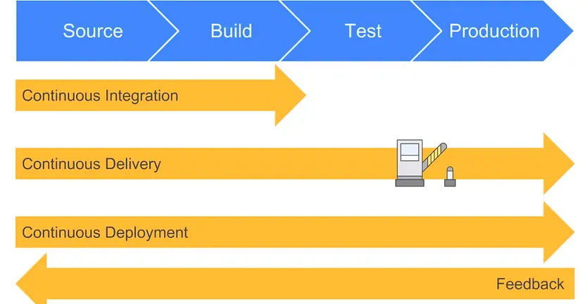

# CI/CD/CDE

- Article One: https://medium.com/@ahshahkhan/devops-culture-and-cicd-3761cfc62450
- Article Two: https://about.gitlab.com/topics/ci-cd/
- Article Three: https://www.atlassian.com/continuous-delivery/principles/continuous-integration-vs-delivery-vs-deployment 

## Continuous Integration

- Source → Build, Test, Production
- Developers merge/commit code to main branch multiple times a day, fully automated build and test process which gives feedback within few minutes, by doing so, you avoid the integration hell that usually happens when people wait for release day to merge their changes into the release branch**.**

## Continuous Delivery

- Source → Build → Test →(manual) Production
- **Continuous Delivery** is an extension of continuous integration to make sure that you can release new changes to your customers quickly in a sustainable way. This means that on top of having automated your testing, you also have automated your release process and you can deploy your application at any point of time by clicking on a button. In continuous Delivery the deployment is completed manually.

## Continuous Deployment

- Source → Build → Test → Production
- **Continuous Deployment** goes one step further than continuous delivery, with this practice, every change that passes all stages of your production pipeline is released to your customers, there is no human intervention, and only a failed test will prevent a new change to be deployed to production.

    

### Takeaways:

- **How CICD Practices relate to each other:** To put it simply, the continuous integration is part of both continuous delivery and continuous deployment. The main difference is the deployment step, in continuous delivery the deployment is done manually and in continuous deployment it happens automatically.
- **What is a CI CD Pipeline**: The CI/CD pipeline is all about automation: Initiating code builds, automated testing, and automated deploying to the staging or production environments. It’s complex and exciting at the same time, but incredibly fast, if the output of any stage fails, the next stage will also fail.

## **CI/CD explained**

- CI/CD falls under DevOps (the joining of development and operations teams) and combines the practices of continuous integration and continuous delivery.
- CI/CD automates much or all of the manual human intervention traditionally needed to get new code from a commit into production, encompassing the build, test (including integration tests, unit tests, and regression tests), and deploy phases, as well as infrastructure provisioning.
- With a CI/CD pipeline, development teams can make changes to code that are then automatically tested and pushed out for delivery and deployment. Get CI/CD right and downtime is minimized and code releases happen faster.
- Using CI/CD teams can release new features and fixes faster and more frequently, enhancing the product's responsiveness to user needs. By continuously integrating and deploying, errors are detected sooner, reducing downtime and improving software quality.

## CI

- The practice of integrating all your code changes into the main branch of a shared source code repository early and often, automatically testing each change when you commit or merge them, and automatically kicking off a build.

## CD

- A software development practice that works in conjunction with CI to automate the infrastructure provisioning and application release process.
- Once code has been tested and built as part of the CI process, CD takes over during the final stages to ensure it's packaged with everything it needs to deploy to any environment at any time. CD can cover everything from provisioning the infrastructure to deploying the application to the testing or production environment.

## CDE

- Enables organizations to deploy their applications automatically, eliminating the need for human intervention. With continuous deployment, DevOps teams set the criteria for code releases ahead of time and when those criteria are met and validated, the code is deployed into the production environment.

## **CI/CD fundamentals**

There are eight fundamental elements of CI/CD that help ensure maximum efficiency for your development lifecycle. They span development and deployment. Include these fundamentals in your pipeline to improve your DevOps workflow and software delivery:

1. **A single source repository**
    - Source code management (SCM) that houses all necessary files and scripts to create builds is critical. The repository should contain everything needed for the build. This includes source code, database structure, libraries, properties files, and version control. It should also contain test scripts and scripts to build applications.
2. **Frequent check-ins to main branch**
    - Integrate code in your trunk, mainline or master branch — i.e., trunk-based development — early and often. Avoid sub-branches and work with the main branch only. Use small segments of code and merge them into the branch as frequently as possible. Don't merge more than one change at a time.
3. **Automated builds**
    - Scripts should include everything you need to build from a single command. This includes web server files, database scripts, and application software. The CI processes should automatically package and compile the code into a usable application.
4. **Self-testing builds**
    - CI/CD requires continuous testing. Testing scripts should ensure that the failure of a test results in a failed build. Use static pre-build testing scripts to check code for integrity, quality, and security compliance. Only allow code that passes static tests into the build.
5. **Frequent iterations**
    - Multiple commits to the repository results in fewer places for conflicts to hide. Make small, frequent iterations rather than major changes. By doing this, it's possible to roll changes back easily if there's a problem or conflict.
6. **Stable testing environments**
    - Code should be tested in a cloned version of the production environment. You can't test new code in the live production version. Create a cloned environment that's as close as possible to the real environment. Use rigorous testing scripts to detect and identify bugs that slipped through the initial pre-build testing process.
7. **Maximum visibility**
    - Every developer should be able to access the latest executables and see any changes made to the repository. Information in the repository should be visible to all. Use version control to manage handoffs so developers know which is the latest version. Maximum visibility means everyone can monitor progress and identify potential concerns.
8. **Predictable deployments anytime**
    - Deployments should be so routine and low-risk that the team is comfortable doing them anytime. CI/CD testing and verification processes should be rigorous and reliable, giving the team confidence to deploy updates at any time. Frequent deployments incorporating limited changes also pose lower risks and can be easily rolled back.