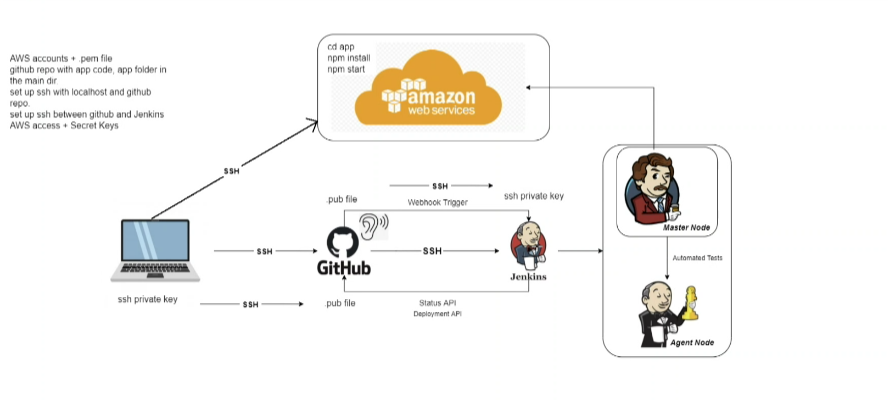
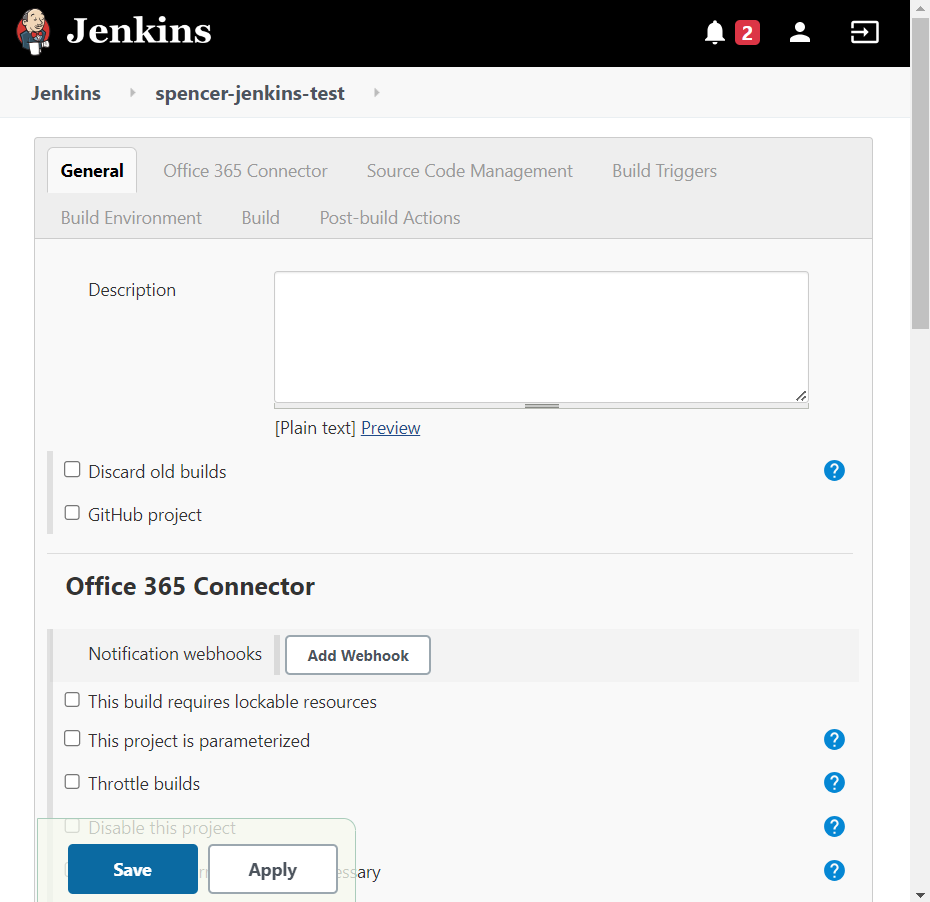
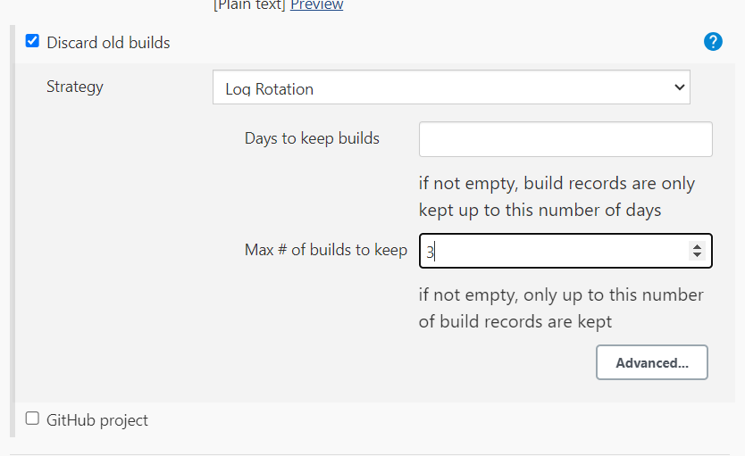
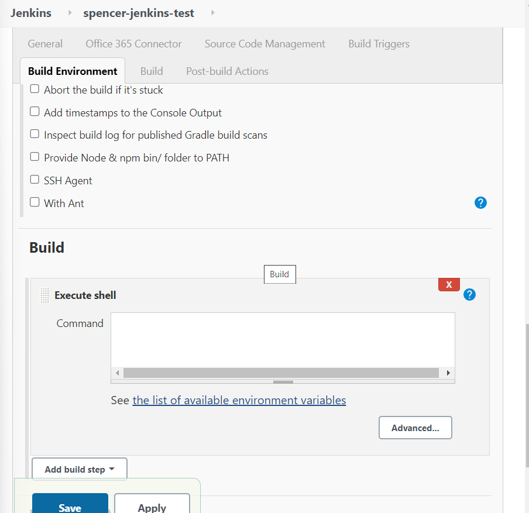
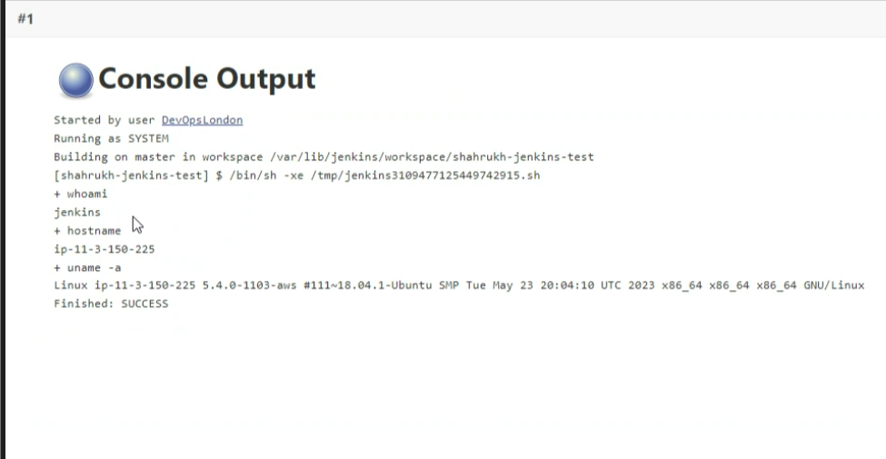
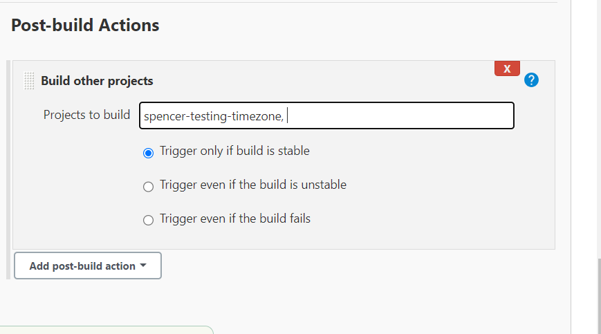
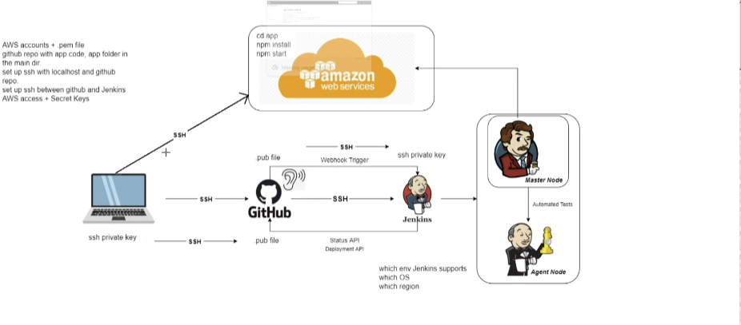

# Jenkins:

- Open source tool for building CI/CD pipelines.
- Automation Tool.
- We want automated testing.
- Keep all your environments seperate for testing.
- If tests pass, push to production else feedback to developers

- Everything done in Jenkins is called a job.

- `whoami` - Software
- `hostname` - IP address
- `uname -a`  - Full details
- If a test fails go to configure and you can change the script or topic to fix it save it and build again.
   
- `date` - where is our server running
- Job pipeline, when one is complete move onto the next one:
    - if linux next job else find out how to build env
    
- Build one job at a time, test that it works then add to pipeline then test pipeline then repeat.

