# Jenkins:

- Open source tool for building CI/CD pipelines.
- Automation Tool.
- We want automated testing.
- Keep all your environments seperate for testing.
- If tests pass, push to production else feedback to developers
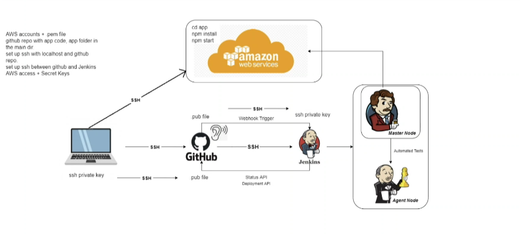
- Everything done in Jenkins is called a job.
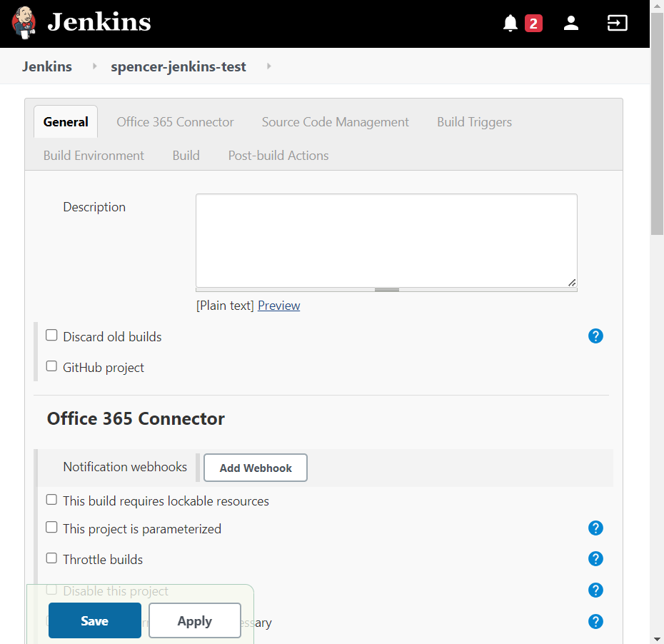
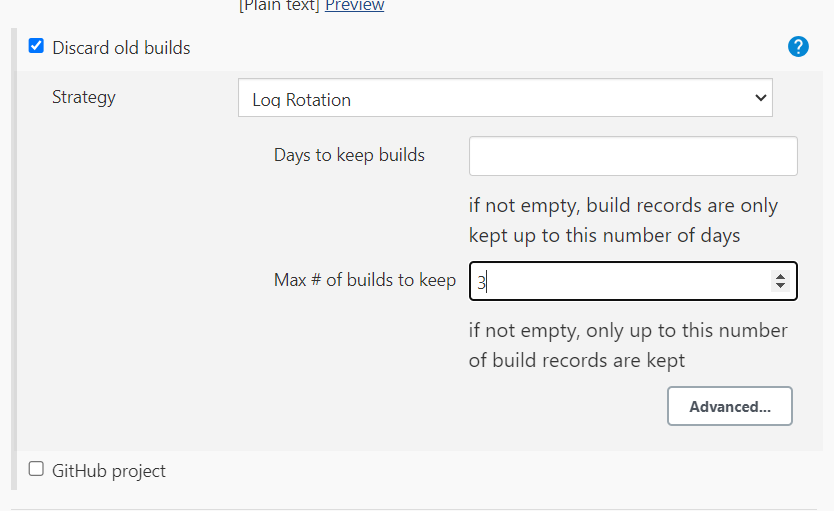
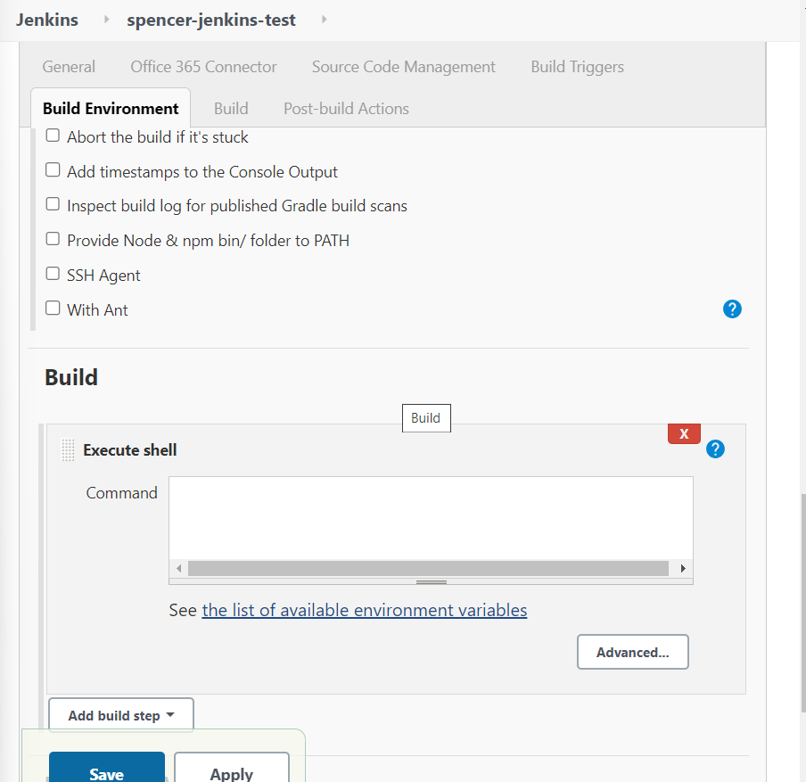
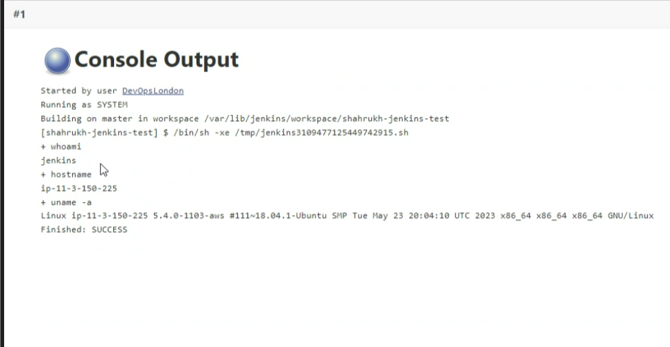
- `whoami` - Software
- `hostname` - IP address
- `uname -a`  - Full details
- If a test fails go to configure and you can change the script or topic to fix it save it and build again.
   
- `date` - where is our server running
- Job pipeline, when one is complete move onto the next one:
    - if linux next job else find out how to build env
    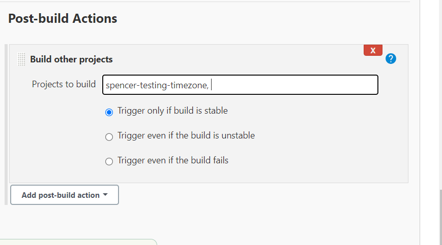
- Build one job at a time, test that it works then add to pipeline then test pipeline then repeat.

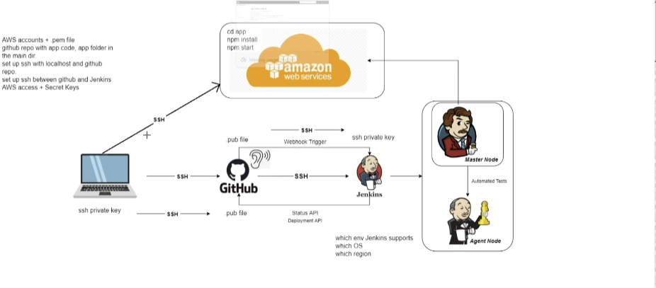

## Using SSH with Jenkins
1. Make sure the Public key is added to the repo as a deploy key
2. Set up the log rotation to be the same as above
3. Tick GitHub project and add the https link
4. Tick restrict where this project can run and add the Label Expression
    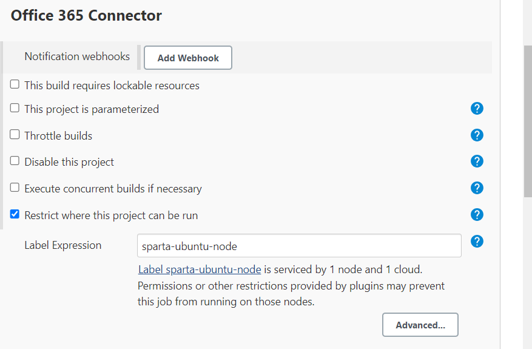
5. Source Code Management tick Git and add the SSH Link 
    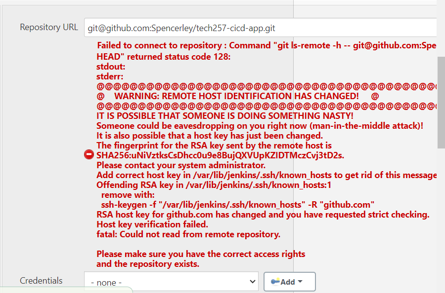
6. then add your private key include the white space at beginning and end & just straight copy paste from top to bottom and also include the ----OPEN PRIVATE KEY-- and end bit.
    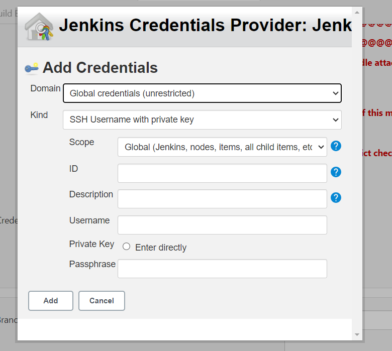
    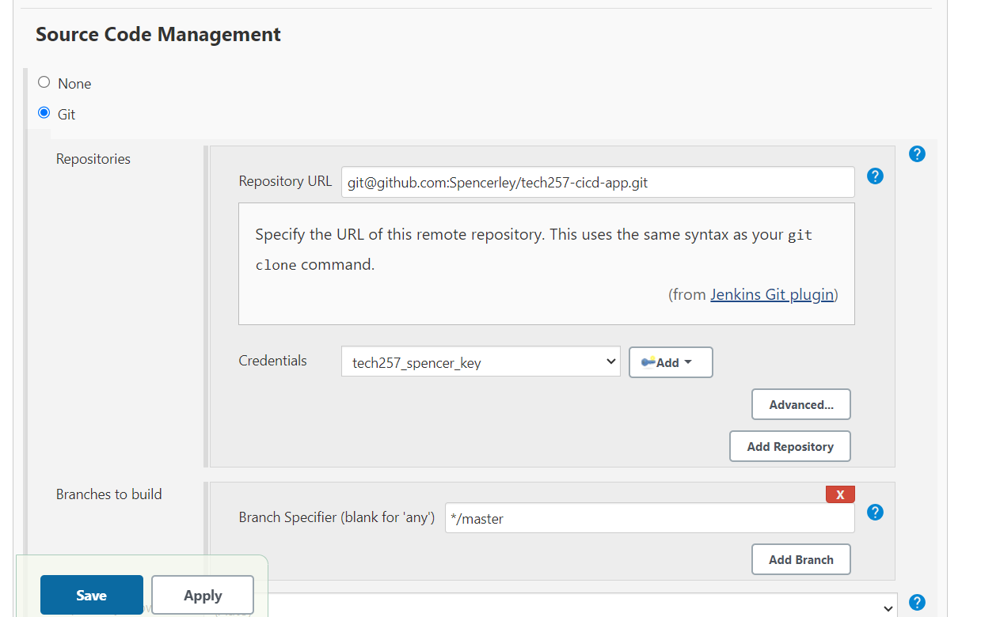

## Webhooks
1.  Set up the webhook in the repo settings adding the ip of your jenkins suite and /github-webhook/ at the end.
    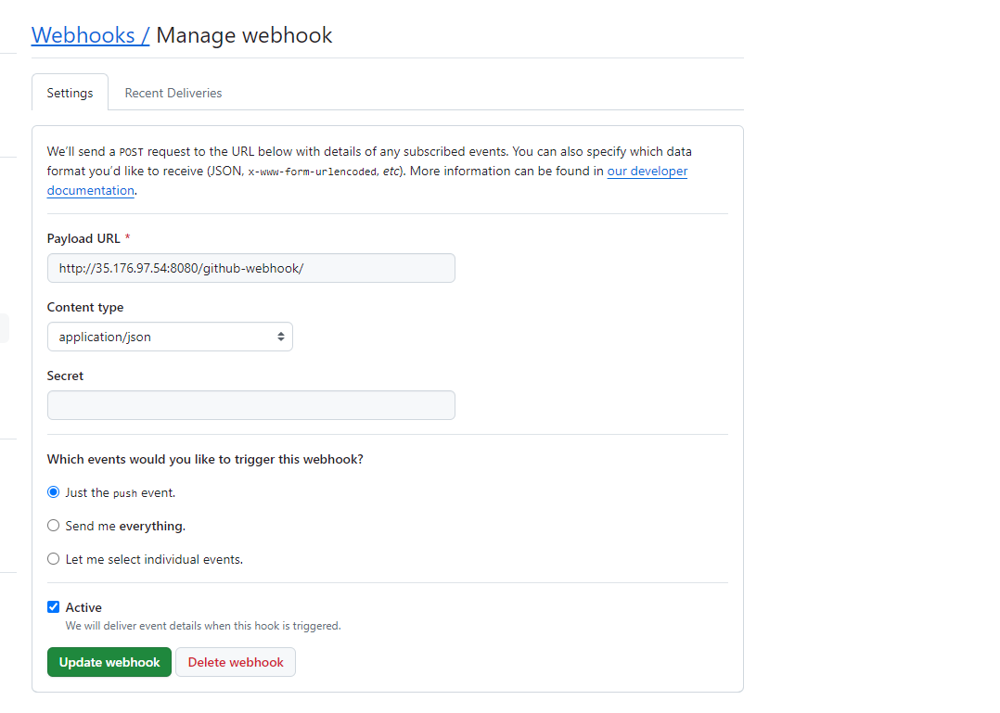
2. Add GitHub hook trigger to Jenkins test.
    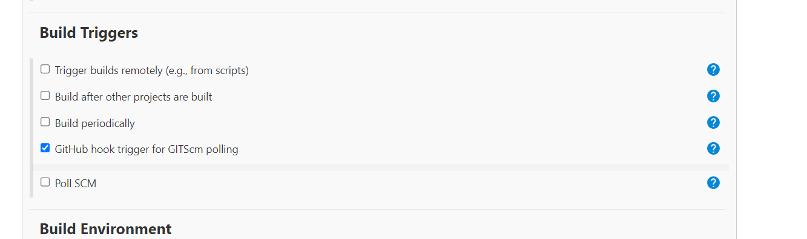
3. Test the web hook is running by making a push to main.

## Step by Step
1. Go to new item
2. Name it
3. Freestyle
4. Click github project
5. Restrict to sparta-ubuntu-node
6. Tick git 
7. Tick github project
8. http in project one and then ssh url in the git source control
9. Put in our key for credentials
10. node and npm enabled
11. Then tick github hook trigger
12. Build step cd app npm install npm start
13. Fianlly save