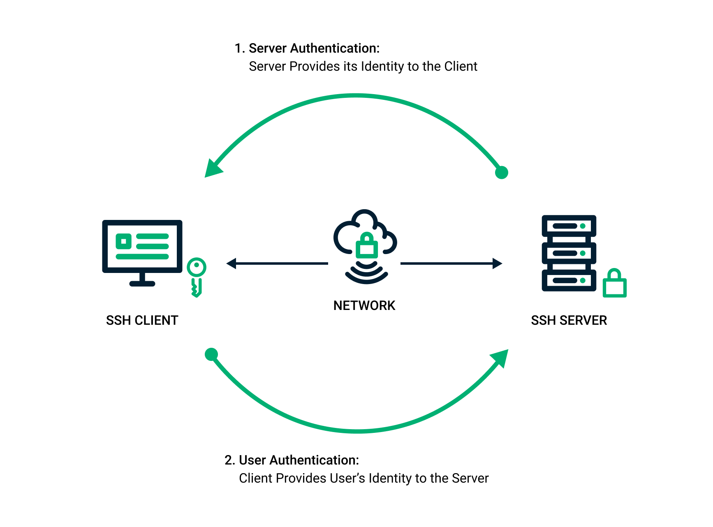

# SSH Documentation

## How do you create an SSH key pair?
Using the ssh-keygen command:
1. `ssh-keygen -t rsa -f C:/Users/<WINDOWS_USER>/.ssh/<KEY_FILENAME> -C <email> -b 2048`
2. eval `ssh-agent -s`
3. `ssh-add <path-to-key>`
4. cd into ssh folder
5. cat the public key `cat <key-name.pub>`
6. Copy the key without spaces and add it to deploy keys in the settings of your repo.
7. Test the connection to GitHub with `ssh -T git@github.com`
8. `git clonegit@github.com:<path-to-repo.git>` using the SSH method instead of https should clone down the repo.

## Why is an SSH Key pair useful
Other than security and privacy.
- When your CI/CD jobs run inside Docker containers (meaning the environment is contained) and you want to deploy your code in a private server, you need a way to access it. In this case, you can use an SSH key pair.
- The SSH key pair is used to authenticate the identity of a user or process that wants to access a remote system using the SSH protocol. The public key is used by both the user and the remote server to encrypt messages.
- The private key remains only on the system being used to access the remote server and is used to decrypt messages.
 

